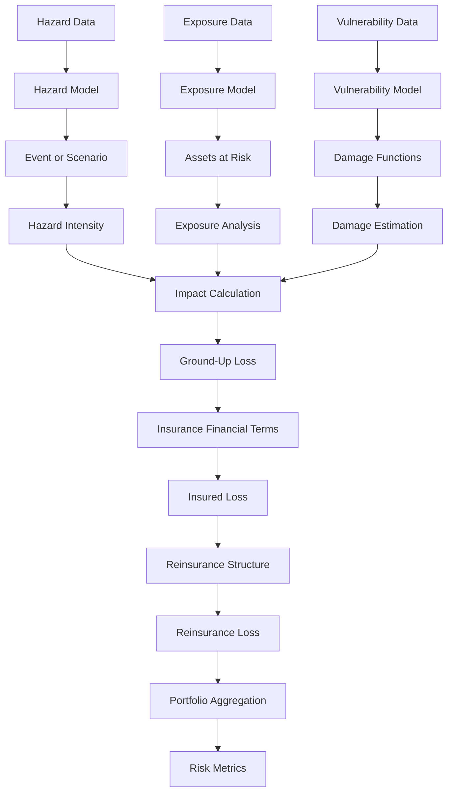
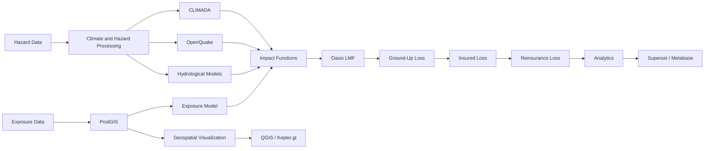

# Awesome-Pharmacy-Inventory-Management

## Top Natural Catastrophe Modeling Platform Ecosystem

**Curated List of SaaS Products & Open-Source GitHub Projects**

*Focused on Natural Hazard Modeling, Catastrophe Risk, Climate Risk, Exposure Analysis, Vulnerability Modeling, Probabilistic Loss Estimation & Disaster Risk Analytics*

**Last updated: August 2026**

This repository tracks notable **SaaS/hosted platforms** and **open-source projects** for **Natural Catastrophe Modeling (NatCat Modeling)**. These tools help insurers, reinsurers, banks, governments, infrastructure operators, asset managers and researchers understand the potential impact of earthquakes, hurricanes, floods, wildfires, severe convective storms, droughts, heatwaves, tsunamis and other natural hazards.

Typical catastrophe modeling capabilities include **hazard modeling, stochastic event generation, exposure management, geospatial analysis, vulnerability functions, damage estimation, probabilistic loss calculation, insured loss estimation, reinsurance analysis, climate scenario analysis, portfolio aggregation, stress testing and risk visualization**.

**Examples** include Moody's RMS, Verisk AIR Worldwide, KCC, Impact Forecasting, Cervest, JBA Risk Management, Fathom, KatRisk and One Concern.

**Open-source emphasis**: This section is heavily expanded with major open-source catastrophe modeling engines, climate-risk frameworks, hazard models, exposure-data standards, geospatial systems, flood and earthquake tools, climate-data libraries and analytics platforms. The open-source NatCat ecosystem is particularly strong for scientific hazard analysis, climate risk and custom catastrophe models. The **Oasis Loss Modelling Framework** is one of the most important open-source foundations for insurance and reinsurance catastrophe loss modeling, while **CLIMADA** provides a major open framework for climate risk and impact assessment.

Contributions welcome! Open a PR to add/update entries. Keep descriptions factual and link to official sites or GitHub repositories.

## Table of Contents

* [SaaS/Hosted Platforms](#saashosted-platforms)

* [Open-Source GitHub Projects](#open-source-github-projects)

* [Additional Strong Open-Source Options](#additional-strong-open-source-options)

* [Frameworks for Building Custom Catastrophe Modeling Systems](#frameworks-for-building-custom-catastrophe-modeling-systems)

* [How to Contribute](#how-to-contribute)

* [Disclaimer](#disclaimer)

## SaaS/Hosted Platforms

* **[Moody's RMS](https://www.rms.com/)**

  Major global catastrophe risk modeling provider offering probabilistic models, exposure analytics and risk intelligence for insurers, reinsurers, financial institutions and governments.

* **[Verisk Extreme Event Solutions / AIR Worldwide](https://www.verisk.com/insurance/brands/air/)**

  Global catastrophe modeling platform providing hazard, vulnerability and financial-loss modeling for insurers, reinsurers and other risk-bearing organizations.

* **[Karen Clark & Company (KCC)](https://www.karenclarkandco.com/)**

  Catastrophe risk modeling and analytics provider specializing in property catastrophe models, reference loss estimates and insurance industry risk analysis.

* **[Impact Forecasting](https://www.aon.com/impactforecasting/)**

  Catastrophe model and risk analytics business providing probabilistic and event-based models for insurers, reinsurers and risk-management organizations.

* **[Cervest](https://www.cervest.earth/)**

  Climate intelligence platform focused on understanding climate-related physical risks and potential impacts on assets, organizations and supply chains.

* **[JBA Risk Management](https://www.jbarisk.com/)**

  Specialist catastrophe and flood risk analytics provider offering flood models, climate risk data and geospatial risk intelligence.

* **[Fathom](https://www.fathom.global/)**

  Flood risk and catastrophe analytics provider offering global flood hazard, exposure and risk intelligence for insurance and financial applications.

* **[KatRisk](https://www.katrisk.com/)**

  Catastrophe risk analytics provider focused on flood, wind, earthquake and other hazard models for insurers and risk professionals.

* **[One Concern](https://www.oneconcern.com/)**

  Climate resilience and disaster-risk analytics platform focused on quantifying the physical and financial impacts of natural hazards.

* **[CoreLogic Hazard Risk Solutions](https://www.corelogic.com/)**

  Property and hazard intelligence provider offering data and risk analytics related to natural hazards and property exposure.

* **[Swiss Re CatNet](https://www.swissre.com/)**

  Natural catastrophe intelligence and hazard information platform supporting property risk assessment and global hazard analysis.

* **[Munich Re NatCatSERVICE](https://www.munichre.com/)**

  Natural catastrophe information and loss-event intelligence supporting catastrophe research and risk understanding.

* **[S&P Global Climate Risk](https://www.spglobal.com/)**

  Climate and physical-risk analytics supporting financial institutions and organizations evaluating environmental and climate-related risk.

* **[Jupiter Intelligence](https://jupiterintel.com/)**

  Climate risk analytics platform providing forward-looking physical climate risk information for organizations and infrastructure.

* **[Climate X](https://www.climate-x.com/)**

  Climate financial-risk analytics platform focused on asset-level physical climate risk and scenario analysis.

* **[Cervest EarthScan](https://www.cervest.earth/)**

  Climate intelligence capabilities for assessing physical climate risk across assets, locations and portfolios.

* **[Risk Management Solutions Intelligent Risk Platform](https://www.rms.com/)**

  Enterprise catastrophe modeling and risk-management infrastructure for large insurance and reinsurance portfolios.

## Open-Source GitHub Projects

### Core Catastrophe Loss Modeling Platforms

* **[Oasis Loss Modelling Framework (Oasis LMF)](https://github.com/OasisLMF/OasisLMF)**

  One of the most important open-source catastrophe modeling frameworks. It supports development, testing and execution of catastrophe models and can calculate ground-up, insured and reinsurance losses.

* **[Oasis Platform](https://github.com/OasisLMF/OasisPlatform)**

  Open-source catastrophe loss modeling platform providing infrastructure for deploying and operating catastrophe models through APIs and web-based workflows.

* **[Oasis ktools](https://github.com/OasisLMF/ktools)**

  High-performance open-source catastrophe model calculation engine used for Monte Carlo loss generation, insurance financial calculations and catastrophe loss analysis.

* **[Oasis Models](https://github.com/OasisLMF/OasisModels)**

  Collection of example catastrophe models and model-development demonstrations for the Oasis ecosystem, including windstorm and earthquake examples.

* **[Oasis Open Data Standards](https://github.com/OasisLMF/ODS_Tools)**

  Open-source tools supporting standardized catastrophe modeling data, including exposure and related data structures for model interoperability.

* **[Open Exposure Data](https://github.com/OasisLMF/ODS_OpenExposureData)**

  Open data standards supporting standardized exposure representation and catastrophe-model interoperability within the Oasis ecosystem.

### Climate Risk and Impact Modeling

* **[CLIMADA](https://github.com/CLIMADA-project/climada_python)**

  Major open-source climate risk assessment framework for probabilistic impact calculations, hazard analysis, vulnerability modeling and adaptation assessment.

* **[CLIMADA Petals](https://github.com/CLIMADA-project/climada_petals)**

  Extension ecosystem for CLIMADA providing specialized hazard-generation and climate-risk components, including modules for hazards and exposure data.

* **[PhysRisk](https://github.com/os-climate/physrisk)**

  Open-source physical climate risk calculation engine designed for bottom-up analysis of climate hazards, asset vulnerability and financial or socioeconomic impacts.

* **[OS-Climate](https://github.com/os-climate)**

  Open-source climate-data and analytics ecosystem supporting financial climate-risk assessment, physical risk analysis and climate scenario workflows.

* **[OS-Climate PhysRisk API](https://github.com/os-climate/physrisk)**

  Open-source architecture for exposing physical climate risk calculations through programmatic and hosted interfaces.

### Earthquake and Seismic Risk Modeling

* **[OpenQuake Engine](https://github.com/gem/oq-engine)**

  Major open-source seismic hazard and seismic risk modeling engine developed by the Global Earthquake Model Foundation, supporting probabilistic seismic hazard and loss analysis.

* **[OpenQuake Model Building Toolkit](https://github.com/GEMScienceTools/oq-mbtk)**

  Open-source toolkit supporting development and processing of seismic hazard and earthquake-risk models.

* **[OpenQuake Input Tools](https://github.com/GEMScienceTools/oq-inputs)**

  Open-source utilities and workflows supporting preparation of data and inputs for earthquake hazard and risk modeling.

* **[GEM Vulnerability Toolkit](https://github.com/gem)**

  Open scientific tools and data resources from the Global Earthquake Model ecosystem for seismic hazard, vulnerability and risk analysis.

* **[PyPSHA](https://github.com/usgs/psha)**

  Open-source and research-oriented probabilistic seismic hazard analysis components and workflows.

* **[ShakeMap](https://github.com/usgs/shakemap)**

  Open-source system for producing maps of ground shaking after earthquakes, supporting rapid event impact and exposure analysis.

* **[OpenSHA](https://github.com/opensha/opensha)**

  Open-source seismic hazard analysis framework supporting earthquake rupture forecasting, ground-motion modeling and probabilistic seismic hazard calculations.

### Flood Risk and Hydrological Modeling

* **[RiskScape](https://github.com/NIWA/RiskScape)**

  Open-source natural hazard impact and loss modeling platform designed for combining hazard, exposure and vulnerability information to estimate consequences.

* **[InaSAFE](https://github.com/inasafe/inasafe)**

  Open-source disaster-impact modeling tool that combines hazard and exposure information to estimate potential impacts.

* **[Delft-FIAT](https://github.com/Deltares/Delft-FIAT)**

  Open-source flood impact assessment tool supporting estimation of damages and consequences from flood scenarios.

* **[Delft3D](https://github.com/Deltares/Delft3D)**

  Major open-source hydrodynamic modeling suite useful for coastal, riverine and flood-hazard simulation.

* **[SFINCS](https://github.com/Deltares/SFINCS)**

  Open-source hydrodynamic model designed for efficient simulation of compound flooding and coastal inundation.

* **[LISFLOOD-FP](https://github.com/University-of-Bristol/LISFLOOD-FP)**

  Open-source hydraulic flood-modeling software supporting large-scale flood inundation simulations.

* **[HEC-RAS](https://www.hec.usace.army.mil/software/hec-ras/)**

  Widely used hydraulic modeling software supporting river hydraulics and flood inundation analysis.

* **[PCRaster](https://github.com/pcraster/pcraster)**

  Open-source environmental modeling framework supporting spatial and hydrological modeling.

* **[wflow](https://github.com/Deltares/Wflow.jl)**

  Open-source hydrological modeling framework for catchment-scale water and flood simulations.

* **[RAPID](https://github.com/c-h-david/rapid)**

  Open-source river-routing model useful for large-scale hydrological and flood-risk workflows.

### Wildfire and Fire Risk Modeling

* **[pyrosmoke](https://github.com/openclimatedata/pyrosmoke)**

  Open-source tools and workflows supporting wildfire and smoke analysis.

* **[Fire Weather Index Tools](https://github.com/cffdrs)**

  Open-source implementations and tools related to wildfire weather danger and fire-risk assessment.

* **[pyFire](https://github.com/pyfire)**

  Community open-source tools and frameworks for wildfire modeling and geospatial fire analysis.

* **[Google Earth Engine Fire Tools](https://github.com/google/earthengine-api)**

  Open geospatial workflows that can support wildfire detection, burn-area analysis and hazard monitoring.

### Tropical Cyclone and Windstorm Modeling

* **[CLIMADA Tropical Cyclone Modules](https://github.com/CLIMADA-project/climada_python)**

  Open-source components supporting tropical cyclone hazard, exposure and impact analysis within the CLIMADA framework.

* **[HURDAT2 Tools](https://github.com/topics/hurricane)**

  Community open-source libraries and projects for processing historical tropical cyclone tracks and hurricane data.

* **[TCRM](https://github.com/GeoscienceAustralia/tcrm)**

  Open-source Tropical Cyclone Risk Model supporting stochastic tropical cyclone hazard generation and wind-risk analysis.

* **[STORM](https://github.com/philippemontfort/STORM)**

  Open-source and research-oriented stochastic tropical cyclone modeling approaches for generating synthetic event sets.

* **[CLIMADA Hazard Generation Tools](https://github.com/CLIMADA-project/climada_petals)**

  Open-source modules supporting generation and processing of specialized climate and natural-hazard data.

### Climate Data and Extreme Weather Analysis

* **[xarray](https://github.com/pydata/xarray)**

  Open-source Python library for multidimensional climate, weather and geospatial data analysis.

* **[xclim](https://github.com/Ouranosinc/xclim)**

  Open-source climate-indicator and climate-extremes library for analyzing climate scenarios and weather extremes.

* **[xESMF](https://github.com/pangeo-data/xESMF)**

  Open-source regridding library widely useful for climate and geospatial model data.

* **[Iris](https://github.com/SciTools/iris)**

  Open-source scientific library for analyzing meteorological and climate datasets.

* **[CDO](https://github.com/Climate-Data-Operators/CDO)**

  Major open-source Climate Data Operators toolkit for processing climate model and observational datasets.

* **[ESMF](https://github.com/esmf-org/esmf)**

  Open-source Earth System Modeling Framework supporting scientific model coupling and geospatial data processing.

* **[Pangeo](https://github.com/pangeo-data/pangeo)**

  Open-source ecosystem for scalable analysis of climate, weather and Earth-observation data.

### Geospatial Exposure and Risk Analysis

* **[QGIS](https://github.com/qgis/QGIS)**

  Major open-source geographic information system for hazard visualization, exposure mapping and spatial catastrophe-risk analysis.

* **[GeoServer](https://github.com/geoserver/geoserver)**

  Open-source server for publishing geospatial data and risk maps through standard web services.

* **[PostGIS](https://github.com/postgis/postgis)**

  Open-source geospatial database extension for PostgreSQL, widely used for exposure, hazard and spatial-risk calculations.

* **[GeoPandas](https://github.com/geopandas/geopandas)**

  Open-source Python library for geospatial exposure and hazard analysis.

* **[GDAL](https://github.com/OSGeo/gdal)**

  Major open-source geospatial data-processing library supporting raster and vector hazard datasets.

* **[Rasterio](https://github.com/rasterio/rasterio)**

  Open-source Python library for geospatial raster processing useful for hazard and climate datasets.

* **[WhiteboxTools](https://github.com/jblindsay/whitebox-tools)**

  Open-source geospatial analysis toolkit supporting terrain, hydrology and environmental analysis.

### Disaster Risk and Resilience Platforms

* **[InaSAFE](https://github.com/inasafe/inasafe)**

  Open-source disaster impact analysis software supporting scenario-based analysis of hazards and exposed populations or assets.

* **[OpenDRI](https://github.com/OpenDRI)**

  Open-source disaster-risk information initiatives and tools supporting disaster resilience and risk reduction.

* **[RiskScape](https://github.com/NIWA/RiskScape)**

  Open-source framework for estimating consequences from combinations of hazard, exposure and vulnerability.

* **[OpenDRR](https://github.com/OpenDRR)**

  Open-source disaster risk-reduction tools and components for hazard and risk analysis.

### Portfolio, Insurance and Financial Risk Foundations

* **[Oasis LMF](https://github.com/OasisLMF/OasisLMF)**

  Open catastrophe loss modeling infrastructure supporting ground-up, insured and reinsurance loss calculations.

* **[OpenFisca](https://github.com/openfisca/openfisca-core)**

  Open-source rules-engine infrastructure that can support transparent financial-policy calculations in broader risk and resilience applications.

* **[Open Source Risk Analytics](https://github.com/OpenSourceRisk)**

  Open-source financial risk analytics ecosystem providing quantitative modeling components that can complement catastrophe-risk and financial-loss analysis.

* **[QuantLib](https://github.com/lballabio/QuantLib)**

  Major open-source quantitative finance library useful for integrating catastrophe scenarios into broader financial and portfolio risk analysis.

### Workflow, Data and Automation Infrastructure

* **[Apache Airflow](https://github.com/apache/airflow)**

  Open-source workflow orchestration platform suitable for large catastrophe-data pipelines and scheduled model execution.

* **[Prefect](https://github.com/PrefectHQ/prefect)**

  Open-source workflow orchestration platform useful for scientific and catastrophe-modeling pipelines.

* **[Dagster](https://github.com/dagster-io/dagster)**

  Open-source data orchestration platform suitable for reproducible hazard, exposure and loss-model pipelines.

* **[Kestra](https://github.com/kestra-io/kestra)**

  Open-source orchestration platform useful for large-scale model execution and data-processing workflows.

* **[Apache NiFi](https://github.com/apache/nifi)**

  Open-source data-flow platform suitable for integrating hazard feeds, exposure data and catastrophe-model outputs.

* **[Airbyte](https://github.com/airbytehq/airbyte)**

  Open-source data integration platform for synchronizing exposure, climate, insurance and analytical datasets.

### Analytics and Visualization

* **[Apache Superset](https://github.com/apache/superset)**

  Open-source business intelligence platform suitable for catastrophe portfolio analytics and risk dashboards.

* **[Metabase](https://github.com/metabase/metabase)**

  Open-source analytics platform useful for exposure, loss and catastrophe-risk reporting.

* **[Grafana](https://github.com/grafana/grafana)**

  Open-source visualization platform suitable for operational monitoring and catastrophe-risk dashboards.

* **[Kepler.gl](https://github.com/keplergl/kepler.gl)**

  Open-source geospatial visualization platform for interactive mapping of exposures, hazards and modeled losses.

* **[deck.gl](https://github.com/visgl/deck.gl)**

  Open-source framework for high-performance geospatial visualization and large-scale risk maps.

* **[Redash](https://github.com/getredash/redash)**

  Open-source query and visualization platform for catastrophe and portfolio analytics.

## Additional Strong Open-Source Options

* **Catastrophe loss modeling**: Oasis LMF, Oasis Platform, Oasis ktools and Oasis example models.

* **Climate impact modeling**: CLIMADA, CLIMADA Petals and PhysRisk.

* **Earthquake modeling**: OpenQuake, OpenSHA, ShakeMap and GEM scientific tools.

* **Flood risk**: RiskScape, Delft-FIAT, Delft3D, SFINCS, LISFLOOD-FP, PCRaster and wflow.

* **Tropical cyclone modeling**: TCRM, CLIMADA hazard modules and community stochastic cyclone projects.

* **Wildfire analysis**: Open fire-weather tools, Earth-observation workflows and scientific wildfire-modeling libraries.

* **Climate data**: xarray, xclim, xESMF, Iris, CDO, ESMF and Pangeo.

* **Exposure management**: PostGIS, QGIS, GeoPandas, GDAL and Rasterio.

* **Geospatial visualization**: Kepler.gl, deck.gl, QGIS and GeoServer.

* **Workflow orchestration**: Apache Airflow, Prefect, Dagster and Kestra.

* **Data integration**: Airbyte, Apache NiFi and custom ETL pipelines.

* **Analytics**: Apache Superset, Metabase, Grafana and Redash.

* Many scientific projects can be combined to support **hazard generation, stochastic event sets, exposure mapping, vulnerability functions, damage estimation, insured losses and climate scenario analysis**.

## Frameworks for Building Custom Catastrophe Modeling Systems

A practical open-source Natural Catastrophe Modeling architecture can combine:

**Catastrophe Loss Engine** → Oasis LMF

**Climate Impact Engine** → CLIMADA

**Physical Climate Risk** → PhysRisk

**Earthquake Risk** → OpenQuake / OpenSHA

**Flood Hazard** → Delft-FIAT / SFINCS / RiskScape

**Hydrology** → PCRaster / wflow

**Exposure Database** → PostgreSQL + PostGIS

**Geospatial Analysis** → QGIS / GeoPandas

**Climate Data Processing** → xarray / xclim / CDO

**Workflow Orchestration** → Airflow / Prefect / Dagster

**Data Integration** → Airbyte / Apache NiFi

**Analytics** → Superset / Metabase

**Risk Maps** → Kepler.gl / deck.gl

**API Layer** → FastAPI / PostgREST / Hasura

A strong open-source catastrophe-loss stack could be:

**Oasis LMF + PostGIS + QGIS + Airflow + Apache Superset**

For climate physical-risk analysis:

**CLIMADA + PhysRisk + xarray + xclim + PostGIS + Kepler.gl**

For flood catastrophe analysis:

**RiskScape + Delft-FIAT + SFINCS + PostGIS + QGIS**

For earthquake risk:

**OpenQuake + OpenSHA + PostGIS + GeoPandas + Superset**

For an integrated multi-peril risk platform:

**Oasis LMF + CLIMADA + OpenQuake + PhysRisk + PostGIS + Airflow + Metabase**

## Natural Catastrophe Modeling Workflow

## Open-Source Catastrophe Modeling Architecture

## Catastrophe Modeling Data Model

A typical Natural Catastrophe Modeling platform may include:

* Hazard

* Peril

* Hazard Event

* Stochastic Event

* Historical Event

* Climate Scenario

* Event Footprint

* Hazard Intensity

* Return Period

* Exposure Portfolio

* Asset

* Building

* Property

* Infrastructure Asset

* Geographic Location

* Occupancy

* Construction Type

* Building Height

* Year Built

* Asset Value

* Replacement Cost

* Policy

* Insurance Coverage

* Deductible

* Limit

* Vulnerability Function

* Damage Ratio

* Damage State

* Ground-Up Loss

* Insured Loss

* Reinsurance Loss

* Treaty

* Portfolio

* Aggregate Loss

* Average Annual Loss

* Probable Maximum Loss

* Tail Value at Risk

* Scenario Loss

* Climate Projection

* Adaptation Measure

* Risk Score

* Model Version

* Data Source

* Simulation Run

* Audit Record

## Common Natural Catastrophe Modeling Features

A complete Natural Catastrophe Modeling platform may support:

* Multi-peril modeling

* Earthquake modeling

* Tropical cyclone modeling

* Flood modeling

* Wildfire modeling

* Severe convective storm modeling

* Drought analysis

* Heatwave analysis

* Coastal inundation

* Storm surge

* Landslide analysis

* Volcanic risk

* Tsunami modeling

* Hazard maps

* Stochastic event generation

* Historical event analysis

* Probabilistic risk analysis

* Exposure management

* Geocoding

* Vulnerability modeling

* Damage functions

* Ground-up loss

* Insured loss

* Reinsurance loss

* Portfolio aggregation

* Treaty analysis

* Return-period analysis

* PML analysis

* AAL analysis

* Climate scenario analysis

* Stress testing

* Asset-level risk analysis

* Portfolio-level risk analysis

* Geospatial visualization

* API integration

* Model versioning

* Reproducible simulations

* Risk reporting

## Catastrophe Modeling Lifecycle

## AI-Assisted Catastrophe Modeling

Potential AI-assisted capabilities include:

* Hazard detection

* Event classification

* Satellite-image interpretation

* Exposure data enrichment

* Property attribute estimation

* Building classification

* Vulnerability function discovery

* Flood extent estimation

* Wildfire spread prediction

* Damage assessment

* Claims anomaly detection

* Event-loss estimation

* Scenario generation

* Model calibration assistance

* Data-quality validation

* Natural-language risk reporting

* Portfolio risk summarization

A recommended architecture is:

**Hazard + Exposure Data → Scientific Model → AI Assistance → Risk Analyst Review**

AI-generated outputs should remain subject to scientific validation and expert review, particularly for insurance pricing, capital allocation, regulatory reporting and high-impact resilience decisions.

## Natural Catastrophe Risk KPIs

Useful catastrophe modeling metrics include:

* Average Annual Loss

* Expected Annual Loss

* Probable Maximum Loss

* Return Period Loss

* Value at Risk

* Tail Value at Risk

* Exposed Asset Value

* Insured Value

* Hazard Frequency

* Hazard Severity

* Event Loss

* Portfolio Loss

* Loss Ratio

* Ground-Up Loss

* Insured Loss

* Reinsurance Recovery

* Model Uncertainty

* Exposure Data Completeness

* Geocoding Accuracy

* Vulnerability Coverage

* Climate Scenario Sensitivity

* Portfolio Concentration

* Accumulation Risk

* Regional Risk Concentration

* Tail Risk

* Model Runtime

* Model Reproducibility

## How to Contribute

1. Fork the repo.

2. Add/edit entries in `README.md` following the existing format.

3. Include: name, link, a 1–2 sentence description and whether it is SaaS/hosted or open-source.

4. Clearly indicate whether an open-source project is a complete catastrophe modeling engine, hazard model, scientific framework, geospatial tool or supporting infrastructure.

5. Prefer actively maintained projects with clear licenses, scientific documentation and reproducible methodologies.

6. Submit a PR with a short explanation.

Star the repo if you find it useful!

## Disclaimer

* This is a **community-curated** list — not exhaustive and not an endorsement.

* Natural catastrophe modeling involves substantial scientific, statistical and financial uncertainty.

* Some open-source projects listed here are complete catastrophe or climate-risk frameworks, while others are specialized hazard, hydrological, geospatial or supporting components.

* Commercial catastrophe models may include proprietary hazard catalogs, vulnerability functions, exposure databases and model calibrations that are not replicated by open-source alternatives.

* Model results should not be interpreted as guaranteed predictions of future catastrophe losses.

* Insurance pricing, underwriting, capital allocation and regulatory decisions should use appropriately validated models and qualified risk professionals.

* Climate scenarios and catastrophe projections depend on assumptions, datasets, emissions pathways and model uncertainty.

* Self-hosted systems require appropriate data governance, model validation, geospatial data quality controls, computational infrastructure and reproducibility practices.

---

**Made for insurers, reinsurers, catastrophe modelers, climate-risk analysts, actuaries, governments, infrastructure operators, researchers and developers building transparent risk intelligence.**

Let's make natural catastrophe modeling more **open, scientifically transparent, interoperable, reproducible and data-driven**.
