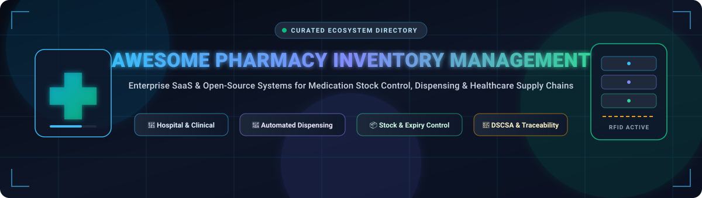

# 💊 Awesome-Pharmacy-Inventory-Management

<p align="center">
  
</p>

<p align="center">
  <a href="https://github.com/ishandutta2007/Awesome-Awesome-Awesome"></a><a href="https://discord.gg/jc4xtF58Ve"></a>
  <a href="https://github.com/ishandutta2007/Awesome-Pharmacy-Inventory-Management/stargazers"></a>
  <a href="https://github.com/ishandutta2007/Awesome-Pharmacy-Inventory-Management/blob/main/LICENSE"></a>
  <a href="https://github.com/ishandutta2007/Awesome-Pharmacy-Inventory-Management/pulls"></a>
  <a href="https://github.com/ishandutta2007"></a>
</p>

---

## 🏥 Top Pharmacy & Healthcare Inventory Management Ecosystem

> **A Curated Knowledge Base of Enterprise SaaS Platforms & Open-Source Software**  
> *Covering Inpatient & Outpatient Pharmacy Inventory, Automated Dispensing Cabinets (ADC), Unit-Dose Repackaging, RFID Medication Tracking, Drug Supply Chain Security Act (DSCSA) Traceability, 340B Drug Pricing Optimization, Expiry & Lot Control, and Healthcare Logistics.*  
> **📅 Last updated: August 2026**

---

## 📖 Overview & SEO Guide

**Pharmacy Inventory Management Systems (PIMS)** and **Hospital Pharmacy Management Software (HPMS)** are mission-critical digital infrastructures for healthcare systems, regional hospitals, retail pharmacy chains, compounding centers, and pharmaceutical distribution networks. 

These solutions manage:
* 💉 **Automated Dispensing & Robotics:** Integration with automated dispensing machines (ADMs/ADCs) and central carousel robotics to streamline medication administration and minimize dispensing errors.
* 📦 **End-to-End Stock Control:** Reorder point triggers, par-level replenishment, physical inventory audits, automated PO creation, and supplier electronic data interchange (EDI).
* 🏷️ **Lot, Batch & Expiration Tracking:** First-Expired, First-Out (FEFO) picking, lot recall isolation, temperature-sensitive cold chain monitoring, and waste minimization.
* 🛡️ **Regulatory & Controlled Substances:** DEA Form 222 electronic logging (CSOS), perpetual controlled substance inventories, diversion prevention, and DSCSA item-level serialization compliance.
* 📊 **340B & Clinical Analytics:** Split-billing management, contract pharmacy integration, inventory valuation accounting, demand forecasting, and drug shortage risk mitigation.

---

## 📑 Table of Contents

* [☁️ SaaS & Hosted Enterprise Platforms](#️-saas--hosted-enterprise-platforms)
* [💻 Open-Source GitHub Projects](#-open-source-github-projects)
* [🏗️ Open-Source Architecture Patterns](#️-open-source-architecture-patterns)
* [📈 Star History](#-star-history)
* [🤝 How to Contribute](#-how-to-contribute)
* [⚖️ Disclaimer](#️-disclaimer)

---

## ☁️ SaaS & Hosted Enterprise Platforms

> 📊 **Sector Market Size & Structure:** The global pharmacy and healthcare inventory management software market is estimated at **$6.2 Billion in 2024** and projected to exceed **$12.8 Billion by 2032** (CAGR: ~9.5%). The inpatient hospital dispensing sector is **highly concentrated (oligopolistic)**—dominated by legacy hardware/cabinet leaders like BD Pyxis, Omnicell, and McKesson due to heavy bedside robotics integration, high capital barrier to entry, EHR interoperability, and DEA regulatory certifications—while remaining **moderately fragmented** across outpatient clinics, ambulatory surgery centers, and specialty inventory SaaS workflows.

*The table below is sorted in descending order by estimated company size (valuation / annual revenue).*

| Platform | Company Size (Revenue / Valuation) | Description | Pricing (Starting Tier) | Free Tier / Free Trial Limits |
| :--- | :--- | :--- | :--- | :--- |
| **[Oracle Health](https://www.oracle.com/health/)** | ~$380B+ Market Cap / ~$53B Annual Revenue | Enterprise healthcare operational platform supporting electronic health records, pharmacy workflows, and hospital supply chain management. | Starting from ~$2,000/month (~$24,000/year base cloud pharmacy & supply chain module) | No permanent free tier; 0-day self-serve trial (guided cloud sandbox demonstration on request) |
| **[McKesson EnterpriseRx](https://www.mckesson.com/)** | ~$75B+ Market Cap / ~$310B Annual Revenue | Enterprise pharmacy management platform supporting central prescription workflows, dispensing operations, purchasing, and business administration. | Starting from ~$1,100/month (~$13,200/year base pharmacy management license) | No permanent free tier; 0-day self-serve trial (scheduled live product walkthrough and consultation on request) |
| **[McKesson Supply Chain Solutions](https://www.mckesson.com/)** | ~$75B+ Market Cap / ~$310B Annual Revenue | Large-scale healthcare supply-chain technologies supporting pharmaceutical distribution, dynamic replenishment, and inventory operations. | Starting from ~$1,200/month (~$14,400/year enterprise inventory portal license) | No permanent free tier; 0-day self-serve trial (guided supply spend evaluation and platform walkthrough on request) |
| **[Supplylogix](https://www.supplylogix.com/)** | ~$75B+ Parent Market Cap (McKesson) | Pharmacy analytics and inventory optimization software (Pinpoint suite) offering demand forecasting, purchasing intelligence, and multi-location balancing. | Starting from ~$500/month (~$6,000/year per pharmacy location for Pinpoint inventory suite) | No permanent free tier; 0-day self-serve trial (guided live demo and historical data analysis preview on request) |
| **[BD Pyxis](https://www.bd.com/)** | ~$70B+ Market Cap / ~$20B Annual Revenue | Industry-leading automated medication dispensing and point-of-use inventory cabinets with clinical EHR integration and diversion monitoring. | Starting from ~$1,500/month (~$18,000/year base software & maintenance license; cabinet units from ~$15,000–$50,000) | No permanent free tier; 0-day self-serve trial (interactive clinical demo and workflow evaluation on request) |
| **[BD HealthSight](https://www.bd.com/)** | ~$70B+ Market Cap (BD) | Enterprise healthcare clinical analytics and medication-management platform providing operational visibility across hospital dispensing ecosystems. | Starting from ~$1,800/month (~$21,600/year hospital analytics subscription) | No permanent free tier; 0-day self-serve trial (guided enterprise visibility demo on request) |
| **[Parata](https://www.parata.com/)** | ~$70B+ Parent Market Cap (BD / $1.5B Acquisition) | Automated medication packaging and high-speed robotic vial-filling systems designed to streamline pharmacy fulfillment and stock replenishment. | Starting from ~$1,200/month (~$14,400/year software management suite; automated vial/pouch packagers from ~$14,000) | No permanent free tier; 0-day self-serve trial (scheduled live product demo on request) |
| **[Swisslog Healthcare](https://www.swisslog-healthcare.com/)** | ~$55B+ Parent Market Cap (Midea Group / KUKA) | Inpatient pharmacy automation systems offering BoxPicker automated storage, pneumatic tube delivery, and medication inventory control software. | Starting from ~$2,500/month (~$30,000/year base platform & software control license) | No permanent free tier; 0-day self-serve trial (guided workflow simulation and technical demo on request) |
| **[WaveMark](https://www.wavemark.com/)** | ~$28B+ Market Cap (Cardinal Health) | RFID-enabled clinical supply chain and pharmacy inventory management platform providing real-time point-of-care asset tracking. | Starting from ~$1,500/month (~$18,000/year per department / clinical site) | No permanent free tier; 0-day self-serve trial (live interactive clinical demo & inventory audit on request) |
| **[Infor Healthcare](https://www.infor.com/industries/healthcare)** | ~$13B+ Valuation / ~$125B+ Parent Revenue (Koch) | CloudSuite Healthcare ERP platform supporting advanced healthcare supply chain, procurement, clinical item master, and financial management. | Starting from ~$2,500/month (~$30,000/year entry CloudSuite Healthcare supply chain tier) | No permanent free tier; 0-day self-serve trial (guided enterprise cloud demo and readiness assessment on request) |
| **[Omnicell](https://www.omnicell.com/)** | ~$1.8B–$2.2B Market Cap (NASDAQ: OMCL) | Comprehensive pharmacy automation suite providing automated dispensing cabinets, central pharmacy carousels, and cloud-based inventory intelligence. | Starting from ~$1,200/month (~$14,400/year base software subscription; hardware cabinets from ~$35,000) | No permanent free tier; 0-day self-serve trial (guided live vendor demo & facility assessment available on request) |
| **[Kit Check](https://kitcheck.com/)** | ~$300M–$500M Valuation (Bluesight / Growth-Backed) | RFID medication tray and kit tracking platform automating crash cart replenishment, expiration date tracking, and recall management. | Starting from ~$1,000/month (~$12,000/year platform subscription + RFID scanning hardware / tags) | No permanent free tier; 0-day self-serve trial (guided interactive proof-of-concept demo on request) |
| **[ScriptPro](https://www.scriptpro.com/)** | ~$200M+ Annual Revenue (Privately Held) | Pharmacy automation and management systems delivering robotic prescription dispensing, telepharmacy, and SP Central inventory workflows. | Starting from ~$1,250/month (~$15,000/year base SP Central software license; robotic dispensing systems from ~$42,000) | No permanent free tier; 0-day self-serve trial (live product demonstration and operational workflow analysis on request) |
| **[DoseMeRx](https://doseme-rx.com/)** | ~$20M–$50M Valuation (Specialized Clinical SaaS) | Bayesian precision-dosing platform and clinical medication management SaaS optimizing individual patient drug levels and pharmacy analytics. | Starting from ~$166/month ($1,990/year entry ASHP clinical bundle for single drug model) | Free forever academic plan via The Dosing Institute for students/faculty with .edu email (limited model access); 14-day free institutional trial upon sales request |
| **[BlueBin](https://bluebin.com/)** | ~$15M–$30M Valuation (Specialized Kanban SaaS) | Visual Kanban-based healthcare inventory replenishment and supply chain optimization platform for hospitals and central distribution centers. | Starting from ~$800/month (~$9,600/year base facility subscription) | Free forever web tools (Supply Chain Waste Calculator & ROI Estimator); 0-day self-serve trial for core software (guided discovery demo on request) |

---

## 💻 Open-Source GitHub Projects

The open-source ecosystem provides a comprehensive foundation for building self-hosted, vendor-neutral pharmacy inventory systems, medical warehouse management, public health commodity distribution, and clinical analytics.

*The list below is sorted in descending order by GitHub Star Count.*

1. **[Grafana](https://github.com/grafana/grafana)** [](https://github.com/grafana/grafana/stargazers)  
   *Open-source visualization and dashboard platform for monitoring real-time pharmacy inventory levels, sensor temperature telemetry, and medication distribution KPIs.*

2. **[Apache Superset](https://github.com/apache/superset)** [](https://github.com/apache/superset/stargazers)  
   *Enterprise-grade business intelligence platform for tracking pharmaceutical consumption trends, stock-out forecasting, expiration risk, and 340B audit reports.*

3. **[Odoo Community Edition](https://github.com/odoo/odoo)** [](https://github.com/odoo/odoo/stargazers)  
   *Extensible ERP with advanced double-entry inventory, lot and serial number tracking, multi-warehouse routing, barcode scanner support, and procurement modules.*

4. **[Metabase](https://github.com/metabase/metabase)** [](https://github.com/metabase/metabase/stargazers)  
   *User-friendly BI tool for non-technical clinical teams to query medication inventories, evaluate safety stock levels, and audit supplier fulfillment performance.*

5. **[ERPNext](https://github.com/frappe/erpnext)** [](https://github.com/frappe/erpnext/stargazers)  
   *Full-featured 100% open-source ERP platform featuring batch tracking, expiration management, automated purchasing orders, stock transfers, and accounting.*

6. **[Node-RED](https://github.com/node-red/node-red)** [](https://github.com/node-red/node-red/stargazers)  
   *Low-code flow engine for wiring barcode scanners, RFID readers, IoT temperature sensors, HL7/FHIR messaging, and dispensing hardware to inventory databases.*

7. **[PostgreSQL](https://github.com/postgres/postgres)** [](https://github.com/postgres/postgres/stargazers)  
   *High-performance ACID-compliant relational database serving as the standard backend for transactional healthcare inventory and audit logging.*

8. **[Snipe-IT](https://github.com/snipe/snipe-it)** [](https://github.com/snipe/snipe-it/stargazers)  
   *Open-source asset management platform ideal for tracking durable medical equipment (DME), automated dispensing kiosks, barcode scanners, and handheld terminals.*

9. **[OpenSearch](https://github.com/opensearch-project/OpenSearch)** [](https://github.com/opensearch-project/OpenSearch/stargazers)  
   *Distributed search and analytics engine for high-speed indexing and fuzzy searching across millions of NDC drug codes, medication batches, and supply transactions.*

10. **[Grocy](https://github.com/grocy/grocy)** [](https://github.com/grocy/grocy/stargazers)  
    *Lightweight barcode-driven stock and inventory management platform with built-in expiration tracking, meal/dose consumption logging, and REST APIs.*

11. **[Dolibarr ERP & CRM](https://github.com/Dolibarr/dolibarr)** [](https://github.com/Dolibarr/dolibarr/stargazers)  
    *Modular business software with inventory stock management, purchase order generation, supplier management, and barcode capabilities.*

12. **[InvenTree](https://github.com/inventree/InvenTree)** [](https://github.com/inventree/InvenTree/stargazers)  
    *Python/Django-powered inventory management system with multi-level location hierarchies, lot/batch tracking, bill of materials (BOM), and supplier tracking.*

13. **[HospitalRun](https://github.com/HospitalRun/hospitalrun-frontend)** [](https://github.com/HospitalRun/hospitalrun-frontend/stargazers)  
    *Open-source electronic health record and hospital information system with built-in pharmacy dispensing, medication ordering, and inventory modules.*

14. **[OpenEMR](https://github.com/openemr/openemr)** [](https://github.com/openemr/openemr/stargazers)  
    *ONC-certified open-source electronic medical records and practice management platform featuring comprehensive prescription fulfillment and in-clinic drug inventory.*

15. **[Medplum](https://github.com/medplum/medplum)** [](https://github.com/medplum/medplum/stargazers)  
    *Headless healthcare backend supporting FHIR MedicationRequest, MedicationDispense, and SupplyDelivery resources for building modern custom pharmacy applications.*

16. **[OpenMRS Core](https://github.com/openmrs/openmrs-core)** [](https://github.com/openmrs/openmrs-core/stargazers)  
    *Enterprise clinical medical record platform providing the underlying infrastructure for hospital pharmacy modules and medication order management.*

17. **[PartKeepr](https://github.com/partkeepr/PartKeepr)** [](https://github.com/partkeepr/PartKeepr/stargazers)  
    *Structured electronic inventory management software for tracking item specifications, storage bins, manufacturers, and stock quantity levels.*

18. **[Apache OFBiz](https://github.com/apache/ofbiz-framework)** [](https://github.com/apache/ofbiz-framework/stargazers)  
    *Enterprise automation platform providing robust multi-facility warehouse management, automated replenishment calculation, and supply-chain logistics.*

19. **[OpenBoxes](https://github.com/openboxes/openboxes)** [](https://github.com/openboxes/openboxes/stargazers)  
    *Purpose-built open-source healthcare supply-chain and pharmacy inventory system supporting cold-chain tracking, lot numbers, expiry dates, shipments, and requisitions.*

20. **[ADempiere](https://github.com/adempiere/adempiere)** [](https://github.com/adempiere/adempiere/stargazers)  
    *Enterprise open-source ERP system offering industrial-grade materials management, purchase order verification, warehouse bin allocation, and financial auditing.*

21. **[iDempiere](https://github.com/idempiere/idempiere)** [](https://github.com/idempiere/idempiere/stargazers)  
    *OSGi-based ERP suite supporting enterprise inventory logistics, batch management, supplier price lists, and multi-organization supply-chain operations.*

22. **[Frappe Healthcare](https://github.com/frappe/healthcare)** [](https://github.com/frappe/healthcare/stargazers)  
    *Healthcare management layer for ERPNext that integrates inpatient/outpatient pharmacy dispensing directly with central inventory and billing.*

23. **[DHIS2 Core](https://github.com/dhis2/dhis2-core)** [](https://github.com/dhis2/dhis2-core/stargazers)  
    *Global health management information platform used across national programs for public health commodity tracking, vaccine logistics, and stockout surveillance.*

24. **[SORMAS](https://github.com/hzi-braunschweig/SORMAS-Project)** [](https://github.com/hzi-braunschweig/SORMAS-Project/stargazers)  
    *Outbreak management and disease surveillance system supporting pandemic medical countermeasure tracking and healthcare supply monitoring.*

25. **[LibreHealth EHR](https://github.com/LibreHealthIO/lh-ehr)** [](https://github.com/LibreHealthIO/lh-ehr/stargazers)  
    *Clinically focused open-source electronic health record platform designed for straightforward customization of prescription and inventory workflows.*

26. **[OpenELIS Global 2](https://github.com/I-TECH-UW/OpenELIS-Global-2)** [](https://github.com/I-TECH-UW/OpenELIS-Global-2/stargazers)  
    *Laboratory information management system managing diagnostic reagents, laboratory consumables, lot numbers, and supply replenishment.*

27. **[Tryton](https://github.com/tryton/tryton)** [](https://github.com/tryton/tryton/stargazers)  
    *Modular Python-based business platform with inventory stock valuation, purchase management, supplier fulfillment tracking, and warehouse routing.*

28. **[Bahmni Core](https://github.com/Bahmni/bahmni-core)** [](https://github.com/Bahmni/bahmni-core/stargazers)  
    *Integrated hospital management system combining OpenMRS and ERPNext for unified clinical ordering, dispensing, and inventory stock tracking.*

29. **[OpenLMIS Stock Management](https://github.com/OpenLMIS/stock-management)** [](https://github.com/OpenLMIS/stock-management/stargazers)  
    *Microservice-based logistics management information system engineered for national healthcare supply chains, cold-chain commodities, and health centers.*

30. **[OpenHIM Core](https://github.com/jembi/openhim-core-js)** [](https://github.com/jembi/openhim-core-js/stargazers)  
    *Health Information Mediation (HIM) middleware connecting pharmacy inventory systems to EHRs, national registries, and HL7/FHIR health data exchanges.*

31. **[OpenMRS Stock Management Module](https://github.com/openmrs/openmrs-esm-stock-management)** [](https://github.com/openmrs/openmrs-esm-stock-management/stargazers)  
    *Modern frontend stock management microfrontend for OpenMRS 3.x, supporting batch receipts, physical inventory counts, and transfer requisitions.*

32. **[GNU Health HMIS](https://www.gnuhealth.org/)** [](https://savannah.gnu.org/projects/health)  
    *Free/Libre Hospital Management Information System with integrated pharmacy management, medication verification, prescription tracking, and warehouse stock control.*

---

## 🏗️ Open-Source Architecture Patterns

```
                                  ┌───────────────────────────────┐
                                  │   Bedside & Dispensing Unit   │
                                  │  (Barcode / RFID / Node-RED)  │
                                  └──────────────┬────────────────┘
                                                 │ (HL7 / FHIR / REST)
                                                 ▼
┌───────────────────────────────┐  Sync/Reorder  ┌───────────────────────────────┐
│       Clinical EHR Layer      │ ◄────────────► │     Open-Source Core PIMS     │
│   (OpenMRS / Bahmni / OpenEMR)│                │    (OpenBoxes / ERPNext)      │
└───────────────────────────────┘                └──────────────┬────────────────┘
                                                                │
                                                 ┌──────────────┴────────────────┐
                                                 │                               │
                                                 ▼                               ▼
                                  ┌──────────────────────────────┐┌──────────────────────────────┐
                                  │    Enterprise Procurement    ││    Predictive Analytics      │
                                  │   (Odoo / Dolibarr / OFBiz)  ││ (Superset / Metabase/Grafana)│
                                  └──────────────────────────────┘└──────────────────────────────┘
```

**Recommended Blueprint for Self-Hosted Deployments:**
* **Inventory & Logistics Engine:** Deploy **OpenBoxes** or **ERPNext** as the core multi-warehouse stock management platform.
* **Clinical EHR & Dispensing Interoperability:** Connect via **Medplum** or **OpenHIM** using standard FHIR `MedicationDispense` resources.
* **Point-of-Use & Barcode Scanning:** Implement **Node-RED** workflows connected to physical USB/Bluetooth 2D barcode scanners and label printers.
* **Business Intelligence & Shortage Forecasting:** Connect **PostgreSQL** with **Apache Superset** or **Metabase** to build automated stock-out alerts and inventory turnover reports.

---

## 📈 Star History

[](https://star-history.dera.page/#ishandutta2007/Awesome-Pharmacy-Inventory-Management&type=date&legend=top-left)

---

## 🤝 How to Contribute

1. 🍴 **Fork the repository** on GitHub.
2. 🌿 **Create a new branch** (`git checkout -b feature/add-new-platform`).
3. 📝 **Add or update entries** in `README.md` adhering to the tabular SaaS format or categorized open-source list with star badges.
4. 🚀 **Submit a Pull Request** with a brief rationale and links to official documentation or source repositories.

---

## ⚖️ Disclaimer

* This repository is a **community-curated index** created for educational, research, and evaluation purposes; it does not constitute formal procurement endorsement.
* Pharmacy inventory and automated dispensing systems must comply with regional pharmaceutical regulations (e.g., FDA DSCSA, DEA CSOS, EU Falsified Medicines Directive, HIPAA, and GMP).
* Production self-hosted open-source deployments require proper clinical validation, database replication, audit logging, role-based access control (RBAC), and encryption.

---

<p align="center">
  <b>Made with ❤️ for hospital pharmacists, healthcare logistics engineers, clinical informaticists, and open-source health-tech developers worldwide.</b>
</p>
